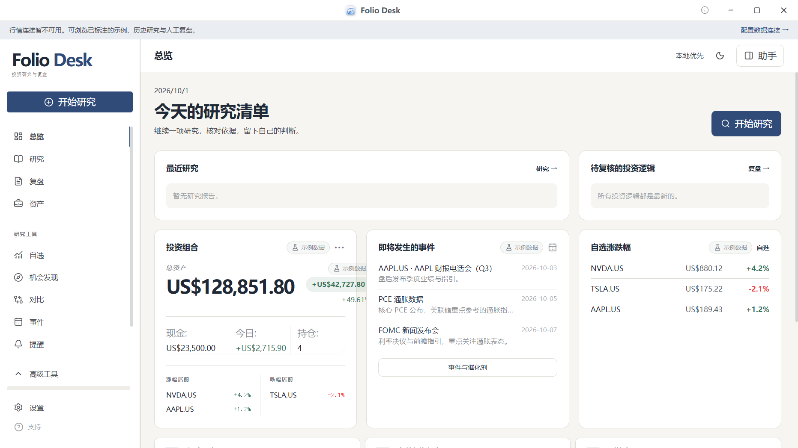
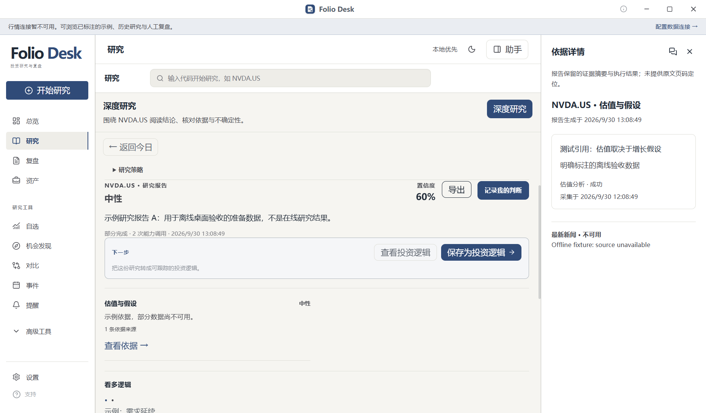
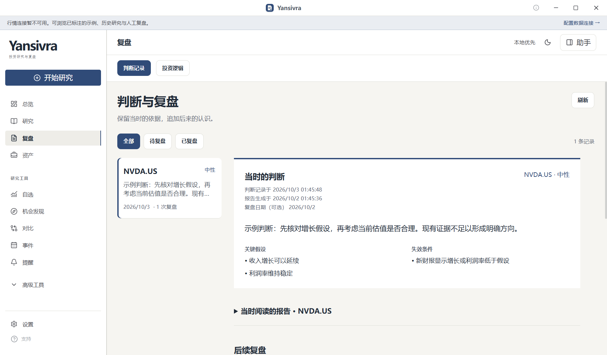

# Yansivra

<p align="center"></p>

[English](README.en.md) · 简体中文 · [验证记录](docs/desktop-validation.md)

**本地优先的 AI 投资研究与复盘桌面工作台。** 将证券行情、深度研究、证据来源、组合风险与个人判断放在同一条工作流中：研究一个标的，核对结论依据，留下当时的理由，再用后续复盘检查关键假设。

当前桌面版本：**0.5.0-beta.1**。暖白与墨蓝界面，绿色主要用于金融涨跌。总览、研究、复盘、资产是四个主入口；自选、比较、事件、提醒和高级工具仍可访问。

## 桌面工作流

- **总览**：继续阅读近期报告，查看到期且尚未复盘的判断，以及组合、自选与事件。
- **证券与组合**：保留自选清单、K 线、财报、新闻、标的比较和组合风险功能。实时数据由已配置的数据连接提供；无连接时展示明确标注的示例或不可用状态。
- **深度研究**：沿用既有研究策略、运行进度、取消/恢复、报告与导出。可以选择历史报告，核对生成时间和部分完成状态。
- **依据检视**：查看报告保留的引用摘要、采集时间、执行结果和缺失数据。检视栏与助手共用右侧空间；隐藏助手不会清空会话草稿。
- **Agent 与技能**：保留上下文感知的会话、金融工具、技能启用状态、连接配置及评测入口。真实模型和行情需要用户配置的外部服务。
- **判断留档**：填写自己的观点、理由、最多三条关键假设与失效条件、可选复盘日期。按正在阅读的报告 ID 保存独立快照，阅读旧报告 A 时不会误存最新报告 B。
- **人工复盘**：原判断保持不变，后续观察与经验只追加。可选择仍成立、被削弱、已失效或证据不足；关闭重开、源报告删除后仍可阅读快照与追加复盘。

保存必须落盘成功才完成。重复请求不会生成重复记录；保存失败会保留输入。复盘草稿在本次应用运行期间跨页面保留，未提交草稿不会在重启后恢复。

## 截图







以上为真实 Windows Electron 窗口截图。报价示例带徽标；研究报告和判断是明确标注的离线验收准备数据，不是在线行情或模型研究结果。

## Windows x64

本轮产物是**未签名的可解压运行目录 / ZIP**，不包含安装器或自动更新。构建后位于：

```text
dist/electron/Yansivra-0.5.0-beta.1-win-x64.zip
dist/electron/win-unpacked/Yansivra.exe
```

解压整个 ZIP 后运行 `Yansivra.exe`，保留同目录资源文件。此分支提供源码与本地打包命令，没有自动上传 GitHub Release。

数据目录保留旧版 Yansivra 路径，应用 ID 仍为 `com.finagent.app`；不自动迁移数据。内部 `@finagent/*` 包名和 `FINAGENT_*` 配置保持兼容。未签名构建跳过可执行文件签名与元数据编辑，系统文件属性和 Explorer 图标可能仍显示 Electron；应用窗口使用新的产品图标。详见 [Windows 构建与运行边界](docs/desktop-windows.md)。

## 开发与验证

需要 Bun、Node.js 和工作区依赖。Windows 安装依赖需要可创建符号链接的环境。

```powershell
git clone https://github.com/Bluuok/Yansivra.git
cd Yansivra
bun install
bun run dev
```

使用本地确定性 Agent，不调用外部模型：

```powershell
$env:FINAGENT_AGENT_PROVIDER = 'local'
bun run dev
```

| 命令 | 用途 |
| --- | --- |
| `bun run typecheck` | 类型检查 |
| `bun run build` | 工作区与生产桌面构建 |
| `bun run test:unit` | 隔离运行全量单元测试 |
| `bun run eval:smoke` | fixture 模式 smoke eval |
| `bun run i18n:check` | 中英文键与插值检查 |
| `bun run test:desktop` | 真实 Electron 布局、journal IPC 和界面闭环 |
| `bun run package:windows` | 构建 Windows x64 目录和 ZIP |
| `bun run test:windows-package` | ZIP 解压到源码外中文/空格路径，验收包内运行 |

桌面验收使用隔离 profile、本地 provider 和隐藏窗口。测试数量、实际通过项及未验证项见 [验证记录](docs/desktop-validation.md)。

## 外部依赖与边界

Longbridge / Massive 数据连接和 Pi / 模型配置沿用上游能力。行情 CLI、账户权限、模型凭据与 Pi 外部运行时不包含在 ZIP 中；请在设置中查看连接状态与报错。本机已通过长桥授权后的 16 项金融数据、DeepSeek Flash 完整研究报告、保存判断、追加复盘和重启持久化，记录见 [验证记录](docs/desktop-validation.md)。该次报价因长桥缺少行情时间而使用 Massive 备用日线，明确带延迟标记；外部请求超时仍会保留“部分完成”。长桥持仓与现金读取被服务端拒绝，券商账户真实集成仍未通过。

判断与人工复盘不需要调用行情或模型。首版没有财报 PDF 原文定位、自动重新评估调度、全文搜索或自动交易。证据只有报告实际保留的字段，不虚构来源链接或页码。

- [桌面改版范围与阶段](docs/desktop-redevelopment.md)
- [实际验证记录](docs/desktop-validation.md)
- [Windows 运行说明](docs/desktop-windows.md)
- [既有系统架构](docs/architecture.zh-CN.md)
- [贡献约定](CONTRIBUTING.md)
