# 实际桌面截图与录屏

全部数据为隔离profile中的明确示例。Before和After使用同一个desktop-showcase脚本、fixture和默认原生窗口；日期按各次运行时间生成。矩阵另加入长中文、重复章节key及持久化partial运行，不与短内容showcase混作同一数据对照。

| 页面 | Before | After |
| --- | --- | --- |
| 总览 | 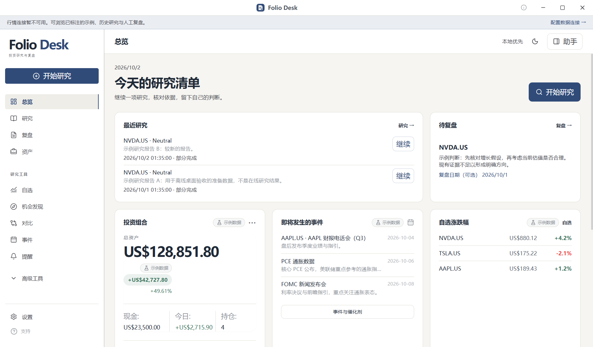 | 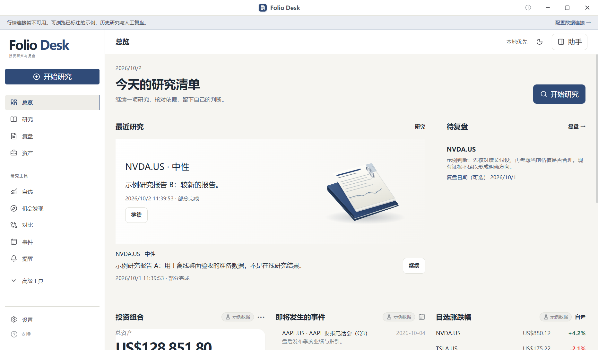 |
| 研究与依据 | 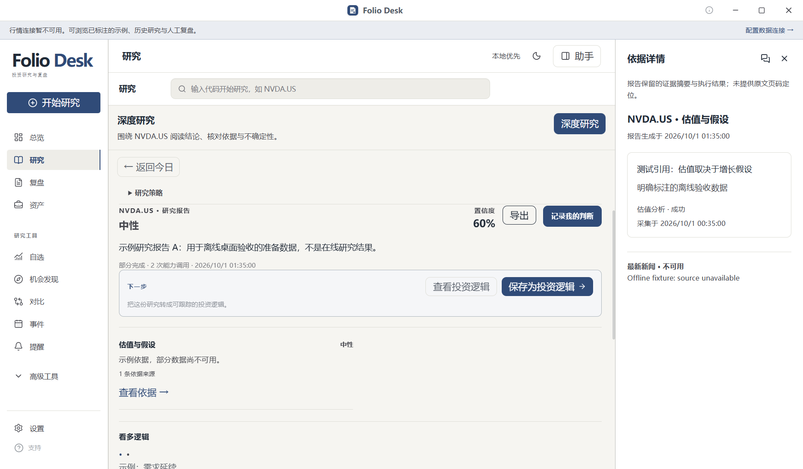 | 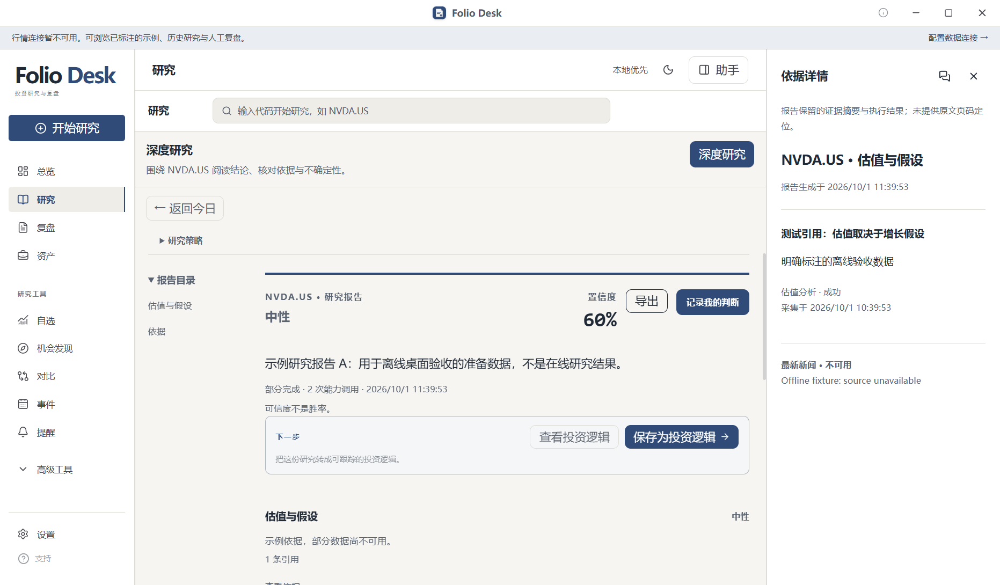 |
| 复盘 | 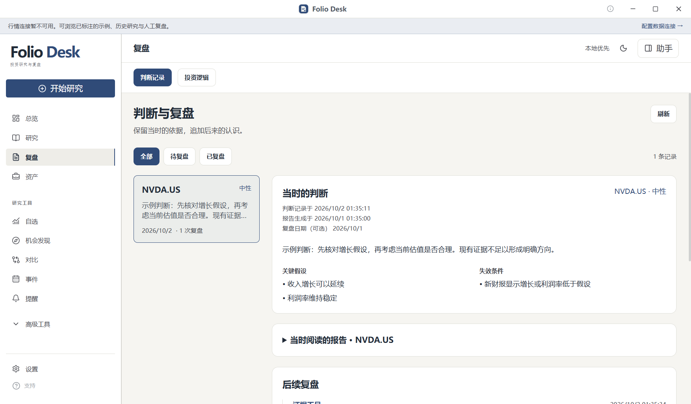 | 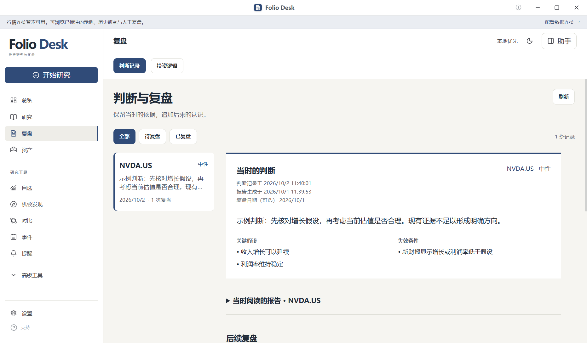 |

## 明暗与正文

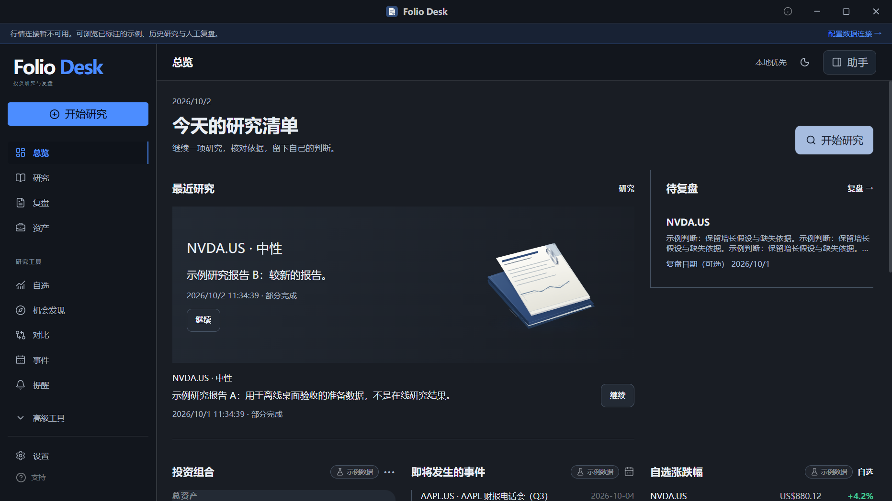
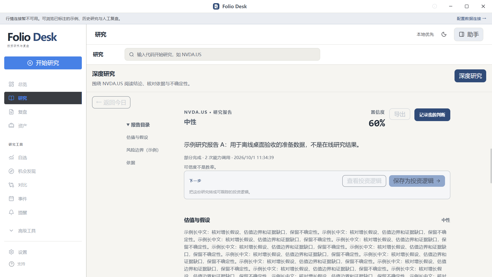
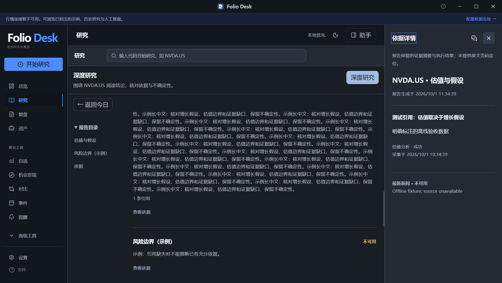
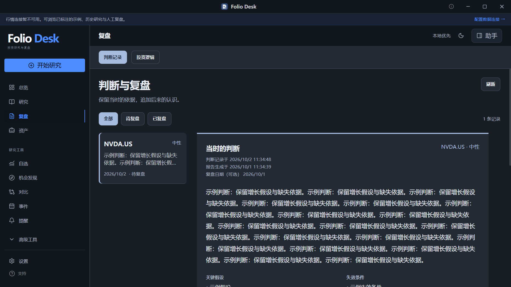

完整矩阵：[viewport.json](screenshots/runtime/viewport.json)，60行、22图，对应5原生尺寸/zoom×3页×2主题×2motion。800请求实际被最小窗口约束为901 CSS px；125%/150%是应用zoom，不是更改Windows系统DPI。

## 可暂停的真实录屏

- [有限研究动效](videos/flow-motion.webm)：生产ResearchFlowMap的明确组件fixture，7项状态/清理检查，非在线研究。
- [依据联动与页面返回](videos/evidence-link.webm)：矩阵末段实际renderer/preload/main；前段为窗口尺寸恢复与导航，约15.6秒显示依据栏，随后切换章节/关闭。
- [真实文件锁失败与重试](videos/journal-write-retry.webm)：实际IPC，27秒处保存失败且输入保留，30秒处只追加一条并确认已保存。

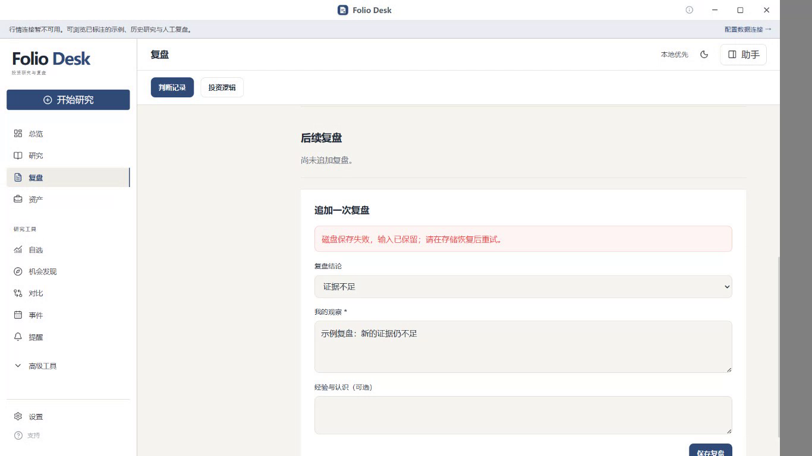
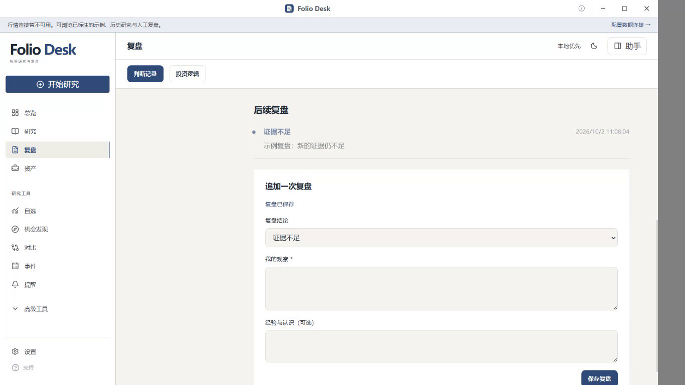

当前生产组件恢复态、partial、reduced、全失败帧分别在runtime目录的flow-*.png；这些帧不冒充在线能力调用。完整命令、源版本、8项跳过和未覆盖范围见[验证记录](visual-validation.md)。
